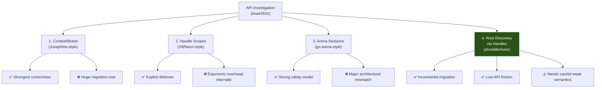
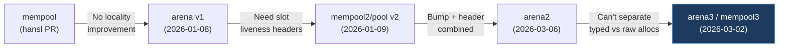

# Phase 1: The Blueprint — `notes/` and `docs/` Analysis

> [!NOTE]
> This document distils every design decision, benchmark result, and architectural constraint found in the `notes/` and `docs/` directories of the **oscars** repository — the experimental proving ground for Boa's next-generation garbage collector.

---

## 1. Document Inventory

| File | Author | Date | Topic |
|---|---|---|---|
| [2025-11-19.md](file:///Users/mrhapile/contributions/oscars/notes/2025-11-19.md) | nekevss | 2025-11-19 | V8 bench baseline; mempool locality failure |
| [2026-01-08.md](file:///Users/mrhapile/contributions/oscars/notes/2026-01-08.md) | nekevss | 2026-01-08 | Arena allocator v1 — MIRI results, header needs |
| [2026-01-09.md](file:///Users/mrhapile/contributions/oscars/notes/2026-01-09.md) | nekevss | 2026-01-09 | Pool allocator v2 — free-slot recycling |
| [gc_api_models.md](file:///Users/mrhapile/contributions/oscars/notes/gc_api_models.md) | — | — | **Core design** — API family investigation for boa#2631 |
| [arena2_vs_boa_gc.md](file:///Users/mrhapile/contributions/oscars/notes/arena2_vs_boa_gc.md) | shruti2522 | 2026-03-06 | arena2 vs boa_gc benchmarks |
| [2026-02-26.md](file:///Users/mrhapile/contributions/oscars/notes/2026-02-26.md) | shruti2522 | 2026-02-26 | WeakMap support implementation |
| [2026-03-15.md](file:///Users/mrhapile/contributions/oscars/notes/2026-03-15.md) | shruti2522 | 2026-03-15 | WeakMap follow-up — HashTable, replace_or_insert |
| [coll_alloc_supertrait/](file:///Users/mrhapile/contributions/oscars/notes/coll_alloc_supertrait) | shruti2522 | 2026-02/03 | `Collector: Allocator` supertrait investigation (6 files) |
| [docs/boa_gc_api_surface.md](file:///Users/mrhapile/contributions/oscars/docs/boa_gc_api_surface.md) | — | — | **Compatibility contract** — full API Boa requires |

---

## 2. Why the Old `boa_gc` Design Was Rejected

The notes document **four primary reasons** for rejecting the existing `boa_gc`:

### 2.1 Tight API/Implementation Coupling
`boa_gc` uses a combined `ref_count` + `non_root_count` scheme to detect roots at collection time (`is_rooted = non_root_count < ref_count`). While this fixed earlier rooting-churn costs (boa PRs #2773, #3109), it **tightly couples the public API to the collector's internal bookkeeping** — making it impossible to swap collectors or evolve the tracing strategy independently.

### 2.2 No Cross-Context Safety
Issue [boa#2631](https://github.com/boa-dev/boa/issues/2631) explicitly calls for an API that **prevents unsafe cross-context sharing patterns** at compile time. The current `Gc<T>` offers no branding or lifetime tokens.

### 2.3 Incompatible with Moving/Compacting Collectors
The current model makes no provision for object relocation. Pointers are raw and assumed stable. This blocks any future compacting or generational collector.

### 2.4 Performance Deficiency in Allocation & Sweep
Benchmarks show:

| Metric | boa_gc | oscars (arena2) | Speedup |
|---|---|---|---|
| Allocation (1000 nodes) | ~56.2 µs | ~27.3 µs | **2.1×** |
| Sweep (1000 objects) | ~74.9 µs | ~29.5 µs | **2.5×** |

The per-allocation indirection and scattered heap layout of `boa_gc` leads to worse cache behavior and higher sweep costs.

---

## 3. The Agreed-Upon Rooting API Direction

### 3.1 Four API Families Investigated

The [gc_api_models.md](file:///Users/mrhapile/contributions/oscars/notes/gc_api_models.md) document evaluates four API families:

### 3.2 Chosen Direction: Root-Discovery via Handles (Option 4)

The selected approach is **root-discovery via handles** (inspired by shredder/rune), primarily because it offers:

- **Incremental transition path** from the current `Gc<T>` model — no big-bang migration required
- **Reduced API friction** compared to strict lifetime branding
- **Compatibility with prototyping** the allocator/collector separation happening in oscars

> [!IMPORTANT]
> The documentation states this direction requires **careful weak/ephemeron semantics** and **clear API boundaries** to prevent accidental misuse. This is an active risk.

### 3.3 NOT Handle Scopes (V8-style)

While handle scopes were considered, they were **not chosen** because they require a wholesale API redesign around scope nesting, which has too much ergonomic overhead for Boa's internal engine paths.

---

## 4. Concurrency & Generational Collection Plans

### 4.1 Concurrency
The [gc_api_models.md](file:///Users/mrhapile/contributions/oscars/notes/gc_api_models.md) states the GC should be **compatible with concurrent collectors**, but there is **no concrete concurrency implementation or plan** in the notes. The current [MarkSweepGarbageCollector](file:///Users/mrhapile/contributions/oscars/oscars/src/collectors/mark_sweep/mod.rs#63-79) is explicitly single-threaded ([RefCell](file:///Users/mrhapile/contributions/oscars/oscars/src/collectors/mark_sweep/cell.rs#94-98)-based interior mutability, no `Arc`/`Mutex`).

### 4.2 Generational Collection
**No documented plans for generational collection exist.** The word "generation" does not appear anywhere in the notes. The focus has been entirely on:
1. Getting the allocator architecture right (arena → arena2 → arena3/mempool3)
2. Establishing the collector/allocator separation
3. Building the correct API surface

### 4.3 Compaction Readiness
The [gc_api_models.md](file:///Users/mrhapile/contributions/oscars/notes/gc_api_models.md) explicitly lists **compaction readiness** as a goal. More critically, the `Collector: Allocator` supertrait investigation was **rejected** specifically because it requires a non-moving collector:

> *"One of the main reasons is that it requires the collector to be non-moving, but the whole point of this redesign is to move Boa towards a moving GC."*
> — [CONCLUSION.md](file:///Users/mrhapile/contributions/oscars/notes/coll_alloc_supertrait/CONCLUSION.md)

This confirms compaction is on the roadmap even though no implementation exists yet.

---

## 5. The Allocator Evolution Timeline

The notes trace a clear evolution through **five allocator generations**:

| Gen | Design | Problem Solved | Problem Remaining |
|---|---|---|---|
| **mempool** | Pre-allocated chunks | Baseline | No locality; cache-misses *increased* vs main |
| **arena v1** | GingerBill bump allocator | Fast allocation | No way to detect dead objects |
| **mempool2** | Pool with free-list recycling | Individual deallocation | Min chunk size = `usize` |
| **arena2** | Linked list + 8-byte per-slot header | Liveness tracking | Can't separate typed/raw allocations; 8B overhead |
| **arena3/mempool3** | Size-class pools + bitmap + bump pages | Typed/raw separation; zero per-object overhead; fast bitmap sweep | Slower allocation (~3× vs arena2) |

> [!TIP]
> The **arena3 → mempool3 rename** reflects the final design: a size-class segmented pool allocator with bitmap liveness, not a classical bump arena. The current production allocator is `mempool3`.

---

## 6. The `Collector: Allocator` Supertrait Investigation

This was a significant sub-investigation documented across 6 files:

### 6.1 The Idea
Make [Collector](file:///Users/mrhapile/contributions/oscars/oscars/src/collectors/mark_sweep/mod.rs#30-58) implement `allocator_api2::Allocator` so that `Vec<T, &Collector>` would place its backing buffer directly in the GC arena, eliminating system allocator round-trips.

### 6.2 Problems Encountered & Solutions

| Problem | Solution |
|---|---|
| `Allocator::allocate(&self)` vs [collect(&mut self)](file:///Users/mrhapile/contributions/oscars/oscars/src/collectors/mark_sweep/mod.rs#407-410) | Move arena to [RefCell](file:///Users/mrhapile/contributions/oscars/oscars/src/collectors/mark_sweep/cell.rs#94-98), borrow_mut only during allocation |
| Reentrancy — allocation triggers collection triggers double borrow | Threshold check + [collect()](file:///Users/mrhapile/contributions/oscars/oscars/src/collectors/mark_sweep/mod.rs#407-410) called *before* taking allocator borrow |
| `deallocate` on a bump allocator is a no-op | `active_raw_allocs` counter; reclaim whole page when zero |
| `Vec<T, &Collector>` is invisible to mark phase | `GcAllocVec<T: Trace>` wrapper that implements [Trace](file:///Users/mrhapile/contributions/oscars/oscars/src/collectors/mark_sweep/trace.rs#49-62) |
| Hidden `'static` lifetime in pointer returns | Changed to `'gc` tied to `&'gc self`; explicit [extend_lifetime()](file:///Users/mrhapile/contributions/oscars/oscars/src/alloc/mempool3/alloc.rs#84-88) at call sites |

### 6.3 Final Verdict: **Rejected**

> [!CAUTION]
> The `Collector: Allocator` supertrait was **abandoned** because it fundamentally requires a non-moving collector. Since the long-term goal is a moving/compacting GC, this design works against that objective.

---

## 7. WeakMap & Ephemeron Design

Two notes ([2026-02-26](file:///Users/mrhapile/contributions/oscars/notes/2026-02-26.md), [2026-03-15](file:///Users/mrhapile/contributions/oscars/notes/2026-03-15.md)) document the WeakMap implementation:

### Key Design Decisions

1. **`WeakGcBox` was refactored** to hold a pointer into an existing `Gc<K>` allocation rather than creating its own copy — fixing a bug where the GC would never see the key as dead
2. **Ephemerons are GC internals** — the `WeakMap` API accepts [(key, value)](file:///Users/mrhapile/contributions/oscars/oscars/src/collectors/mark_sweep/cell.rs#553-557) pairs, never raw ephemerons
3. **Collector ownership** — `WeakMap` is backed by memory the collector owns; no manual registration
4. **`HashTable` over `HashMap`** — stores [(address, EphemeronPtr)](file:///Users/mrhapile/contributions/oscars/oscars/src/collectors/mark_sweep/cell.rs#553-557) inline for better memory locality
5. **`replace_or_insert`** — single-lookup upsert instead of remove-then-insert

---

## 8. The Boa GC API Compatibility Contract

[docs/boa_gc_api_surface.md](file:///Users/mrhapile/contributions/oscars/docs/boa_gc_api_surface.md) defines the **minimum interface** oscars must implement to be a drop-in replacement. It covers:

| Category | Required Types/Operations |
|---|---|
| **Pointer Types** | `Gc<T>`, `WeakGc<T>`, `GcRefCell<T>`, `GcRef<T>`, `GcRefMut<T>` |
| **Allocation** | `Gc::new`, `Gc::new_cyclic` |
| **Identity/Casting** | `Gc::ptr_eq`, `Gc::downcast`, `Gc::cast_unchecked`, `Gc::cast_ref_unchecked` |
| **Raw Conversion** | `Gc::into_raw`, `Gc::from_raw` |
| **Interior Mutability** | `GcRefCell::{new, borrow, borrow_mut, try_borrow, try_borrow_mut, into_inner}` |
| **Borrow Mapping** | `GcRef::map`, `GcRef::try_map`, `GcRef::cast`, `GcRefMut::map/try_map/cast` |
| **Weak References** | `WeakGc::{new, upgrade}`, `Ephemeron` semantics |
| **Weak Collections** | `WeakMap` with full CRUD + `get_or_insert`/`get_or_insert_computed` |
| **Traits** | [Trace](file:///Users/mrhapile/contributions/oscars/oscars/src/collectors/mark_sweep/trace.rs#49-62) (with [trace](file:///Users/mrhapile/contributions/oscars/oscars/src/collectors/mark_sweep/cell.rs#240-247), `trace_non_roots`, [run_finalizer](file:///Users/mrhapile/contributions/oscars/oscars/src/collectors/mark_sweep/trace.rs#273-278)), [Finalize](file:///Users/mrhapile/contributions/oscars/oscars/src/collectors/mark_sweep/trace.rs#22-26) |
| **Macros** | `#[derive(Trace)]`, `#[derive(Finalize)]`, `custom_trace!`, `empty_trace!`, `unsafe_empty_trace!` |
| **Runtime** | `force_collect()`, `finalizer_safe()` |

> [!WARNING]
> **Critical constraint**: Boa's current `Gc::new` takes **no heap handle** — the GC runtime is accessed via thread-local or global state. A replacement collector must either use the same pattern or refactor the engine to pass an explicit context (breaking change).

---

## 9. Upstreaming Strategy

The proposed execution path from [gc_api_models.md](file:///Users/mrhapile/contributions/oscars/notes/gc_api_models.md):

1. **Continue API experiments in oscars** with explicit invariants and benchmark baselines
2. **Define an acceptance checklist** for upstreaming:
   - No cross-context unsoundness
   - Predictable rooting semantics
   - Weak/ephemeron behavior parity
   - No regressions in engine benchmarks and test262 flow
3. **Upstream in slices**:
   - Shared low-risk internals first
   - Then public API transitions with compatibility shims

---

## 10. Summary: Key Takeaways for Integration

| Question | Answer |
|---|---|
| Why reject old `boa_gc`? | Tight coupling, no cross-context safety, no moving GC support, 2-3× slower allocation/sweep |
| Agreed rooting API? | Root-discovery via handles (shredder/rune-inspired) — incremental migration, low friction |
| Handle scopes? | Considered but rejected — too much ergonomic overhead |
| Concurrency plans? | Goal stated, no implementation; current design is single-threaded |
| Generational GC? | Not mentioned anywhere |
| Compaction plans? | Explicitly stated as a long-term goal; drove rejection of `Collector: Allocator` |
| Current allocator? | **mempool3** — size-class pools with bitmap liveness + bump pages for raw bytes |
| Upstream strategy? | Incremental slices with compatibility shims; acceptance checklist required |
