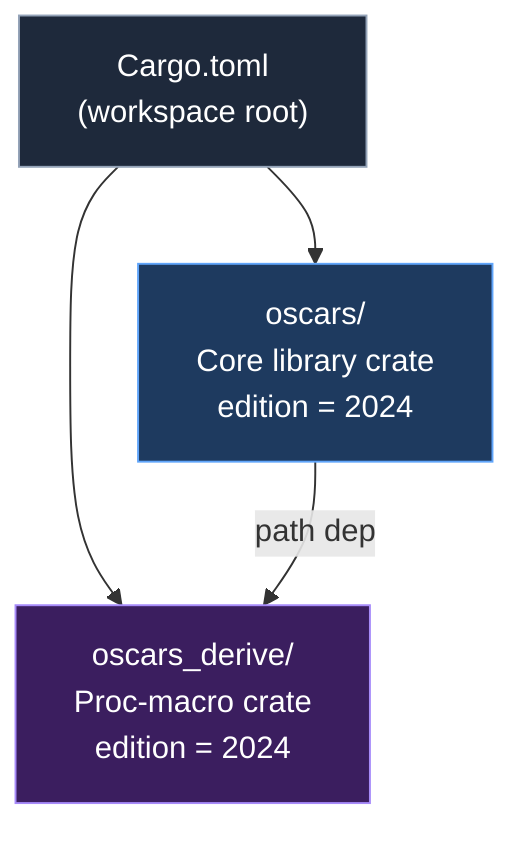
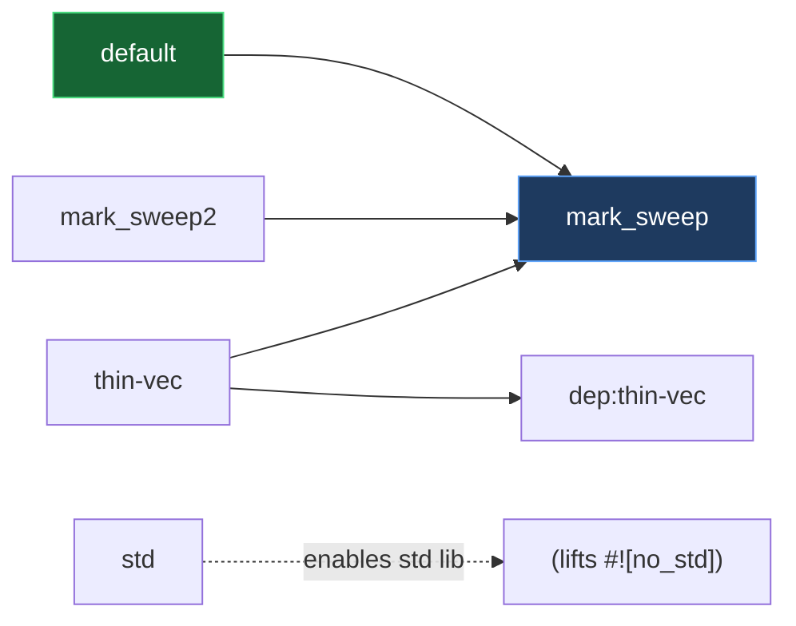

# Phase 2: Project Anatomy — Cargo.toml, Cargo.lock & README

---

## 1. Project Structure: Cargo Workspace

Oscars is a **Cargo workspace** with **two members** and Rust edition 2024 (resolver v3):



> [!NOTE]
> Despite the README mentioning only `src` and `notes`, the actual project is a **two-member workspace**, not a single library crate.

---

## 2. Dependency Graph

### 2.1 `oscars` — Core Library

| Dependency | Version | Type | Purpose |
|---|---|---|---|
| `hashbrown` | 0.16.1 | Runtime | `HashTable`-backed `WeakMap`, used in the Ephemeron/WeakMap internals |
| `oscars_derive` | 0.1.0 (path) | Runtime | `#[derive(Trace)]` and `#[derive(Finalize)]` proc macros |
| `rustc-hash` | 2.1.1 | Runtime | Fast non-cryptographic hashing (FxHash) for GC-internal maps |
| `thin-vec` | 0.2 | Optional | Thinner `Vec` representation; gated behind `thin-vec` feature |
| `criterion` | 0.5 | Dev-only | Benchmarking framework (with HTML reports) |
| `boa_gc` | git (main) | Dev-only | Reference implementation for A/B benchmarking vs oscars |

### 2.2 `oscars_derive` — Proc-Macro Crate

| Dependency | Version | Purpose |
|---|---|---|
| `cfg-if` | 1.0.4 | Conditional compilation in macro code |
| `proc-macro2` | 1.0.105 | Token stream manipulation |
| `quote` | 1.0.43 | Rust code generation in macros |
| `syn` | 2.0.114 | Parsing Rust syntax (`full` + `visit-mut` features) |
| `synstructure` | 0.13.2 | Derive-macro boilerplate reduction |

### 2.3 Transitive Dependencies of Interest (from Cargo.lock)

| Crate | Brought in by | Notes |
|---|---|---|
| `allocator-api2` | `hashbrown` | Used by hashbrown for allocator-aware collections |
| `crossbeam-{deque,epoch,utils}` | `criterion` → `rayon` → `rayon-core` | **Only in dev/bench builds** — not a runtime dependency |
| `rayon` | `criterion` | Parallel benchmark harness — **dev-only** |

---

## 3. Key Finding: No Memory or Concurrency Crates in Production

> [!IMPORTANT]
> **None of the traditional memory/concurrency crates appear as runtime dependencies.** Specifically:
> 
> - ❌ `crossbeam` — only pulled transitively by `criterion` (dev-only)
> - ❌ `parking_lot` — not present anywhere
> - ❌ `bitflags` — not present anywhere
> - ❌ `allocator-api2` — only a transitive dep of `hashbrown`, **not used by oscars itself**
> - ❌ `rayon` — only a dev dependency through criterion
> - ❌ `Arc`, `Mutex` — explicitly avoided to preserve `no_std` compatibility

The GC implements **all memory management primitives from scratch** using only:
- `core::cell::{Cell, RefCell, UnsafeCell}` for interior mutability
- `core::ptr::NonNull` for raw pointer management
- `core::alloc::{Layout}` + `rust_alloc::alloc::{alloc, dealloc}` for OS memory

This is a deliberate design choice — the crate is `#![no_std]` by default (with `extern crate alloc`).

---

## 4. Feature Flags



| Feature | Default? | Effect |
|---|---|---|
| `mark_sweep` | ✅ Yes | Enables the primary [MarkSweepGarbageCollector](file:///Users/mrhapile/contributions/oscars/oscars/src/collectors/mark_sweep/mod.rs#63-79) + [Collector](file:///Users/mrhapile/contributions/oscars/oscars/src/collectors/mark_sweep/mod.rs#30-58) trait + `Gc<T>`/`WeakGc<T>`/etc. |
| `mark_sweep2` | No | Enables the legacy `mark_sweep_arena2` collector (superseded) |
| `std` | No | Lifts `#![no_std]`, enables `HashMap`/`HashSet` trace impls |
| `thin-vec` | No | Enables [Trace](file:///Users/mrhapile/contributions/oscars/oscars/src/collectors/mark_sweep/trace.rs#49-62) impl for `thin_vec::ThinVec<T>` |

> [!TIP]
> The `mark_sweep` feature gates the **entire public API** (`Gc<T>`, `WeakGc<T>`, `GcRefCell<T>`, derive macros, etc.). Without it, the crate only exposes the raw allocator modules.

---

## 5. Build Targets

### Library
The main output is a **library crate** (`oscars`) providing the GC runtime.

### Benchmarks (3 suites, all dev-only)

| Benchmark | Required Feature | Compares |
|---|---|---|
| `oscars_vs_boa_gc` | `mark_sweep` | Full oscars GC vs `boa_gc` (allocation, collection, mixed workloads, graphs) |
| `arena2_vs_mempool3` | — | Legacy arena2 allocator vs current mempool3 allocator |
| `arena2_vs_boa_gc` | — | Legacy arena2 allocator vs `boa_gc` |

---

## 6. `no_std` Architecture

The crate uses a conditional `no_std` approach:

```rust
#![cfg_attr(not(any(test, feature = "std")), no_std)]
extern crate alloc as rust_alloc;  // for Vec, Box, String, etc.
```

- **Tests always run with `std`** (the `test` cfg implicitly provides it)
- **Production code is `no_std` + [alloc](file:///Users/mrhapile/contributions/oscars/oscars/src/alloc/mempool3/alloc.rs#374-380)** — requires only a global allocator, no OS or threading
- **`std` feature** unlocks `HashMap`/`HashSet` trace impls from the standard library

This means the GC is **embeddable in `no_std` environments** (WASM, embedded targets) — an important property for Boa's portability story.

---

## 7. Module Map (from [lib.rs](file:///Users/mrhapile/contributions/oscars/oscars/src/lib.rs))

```
oscars (lib)
├── mark_sweep (pub, gated on feature = "mark_sweep")
│   ├── re-exports: Gc, WeakGc, WeakMap, GcRefCell, GcRef, GcRefMut
│   ├── re-exports: Trace, Finalize, TraceColor, Collector
│   └── derive macros: Trace, Finalize (from oscars_derive)
├── mark_sweep2 (pub, gated on feature = "mark_sweep2")
│   └── re-exports from collectors::mark_sweep_arena2
├── alloc (pub)
│   ├── arena       — v1 bump allocator (historical)
│   ├── arena2      — linked-list + per-slot header (superseded)
│   ├── mempool     — v1 pool allocator (historical)
│   ├── mempool2    — v2 pool with free-list (historical)
│   └── mempool3    — PRODUCTION: size-class pools + bitmap + bump pages
└── collectors (pub)
    ├── mark_sweep       — PRODUCTION: MarkSweepGarbageCollector (uses mempool3)
    └── mark_sweep_arena2 — legacy collector (uses arena2)
```

> [!WARNING]
> Five allocator generations and two collector variants coexist in the codebase. Only `mempool3` + `mark_sweep` is the production path. The others are kept for benchmarking and historical reference.

---

## 8. Summary: Answers to Phase 2 Questions

| Question | Answer |
|---|---|
| **Single library or workspace?** | **Workspace** with 2 members: `oscars` (core library) and `oscars_derive` (proc-macro crate) |
| **Memory crates (crossbeam, bitflags, etc)?** | **None in production.** All memory management is hand-rolled. `crossbeam` appears only transitively through criterion (dev-only). |
| **Concurrency crates (parking_lot, rayon)?** | **None in production.** `rayon` is dev-only via criterion. The GC is explicitly single-threaded using [Cell](file:///Users/mrhapile/contributions/oscars/oscars/src/collectors/mark_sweep/cell.rs#94-98)/[RefCell](file:///Users/mrhapile/contributions/oscars/oscars/src/collectors/mark_sweep/cell.rs#94-98). |
| **Key runtime deps?** | `hashbrown` (hash tables for WeakMap), `rustc-hash` (fast hashing), `oscars_derive` (derive macros) |
| **`no_std` support?** | ✅ Yes — `no_std` by default, only needs a global allocator |
| **Benchmark infrastructure?** | 3 criterion bench suites comparing oscars vs boa_gc and allocator generations |
