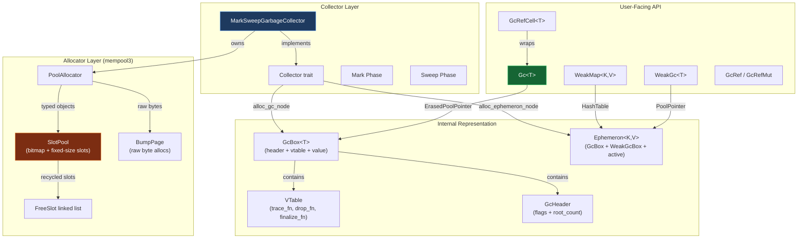
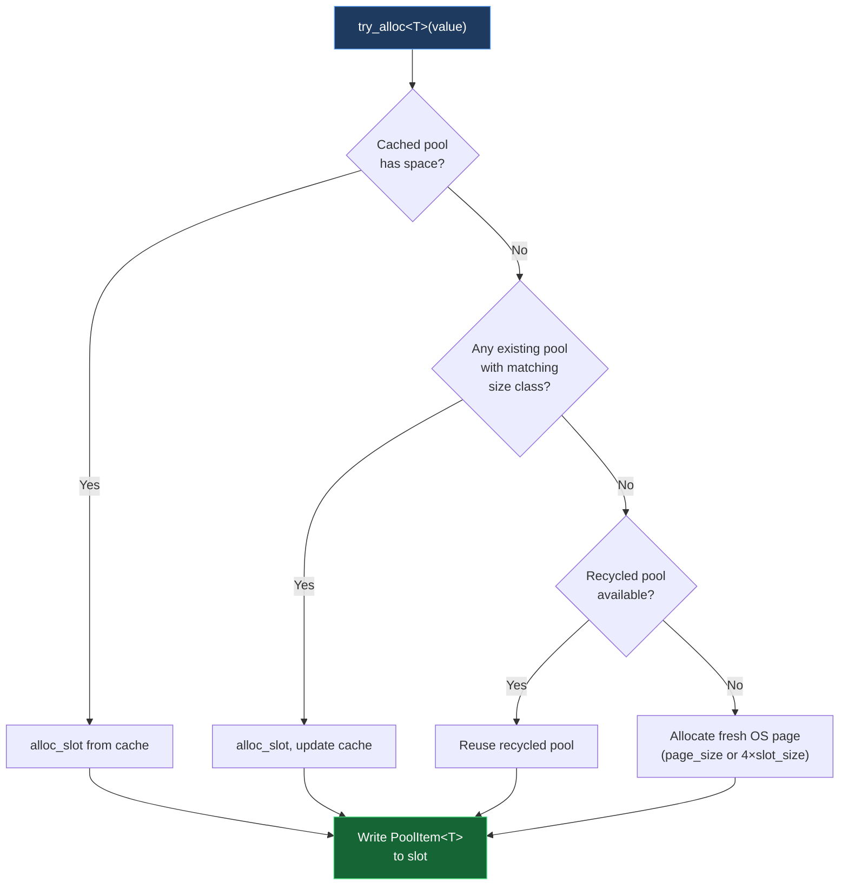
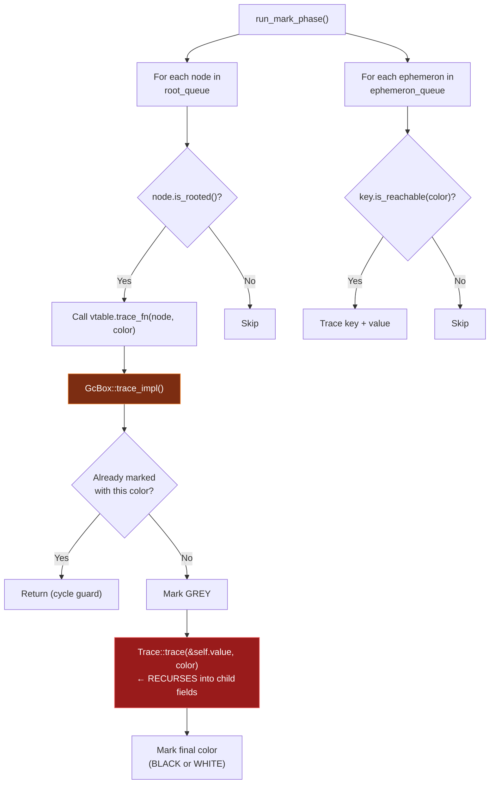
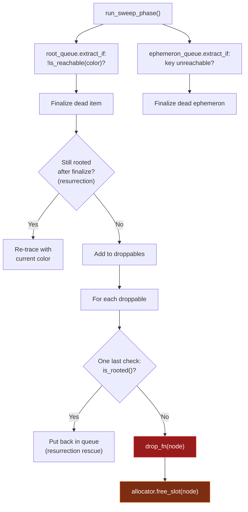

# Phase 3: The Engine Room — `oscars/src/` Deep Dive

> [!NOTE]
> This document maps out the complete memory allocation, collection, and API architecture of the oscars GC by analyzing every source file in `oscars/src/`.

---

## 1. Architecture Overview



---

## 2. The Allocator: mempool3 (Size-Class Pool Allocator)

### 2.1 File Map

| File | Purpose |
|---|---|
| [mempool3/mod.rs](file:///Users/mrhapile/contributions/oscars/oscars/src/alloc/mempool3/mod.rs) | `PoolAllocator` — top-level allocation orchestrator |
| [mempool3/alloc.rs](file:///Users/mrhapile/contributions/oscars/oscars/src/alloc/mempool3/alloc.rs) | `SlotPool` (bitmap pools) + `BumpPage` (raw bytes) + pointer types |

### 2.2 Memory Layout: SlotPool

Each `SlotPool` is a single OS-allocated buffer with the layout:

```
┌─────────────────┬──────────────────────────────────────┐
│  Bitmap          │  Slots                               │
│  (N/64 × 8 bytes)│  [slot₀][slot₁][slot₂]...[slotₙ₋₁]  │
└─────────────────┴──────────────────────────────────────┘
        ↑                        ↑
  1 bit per slot           All same size (size-class)
  tracks liveness          Each slot = PoolItem<T>
```

- **Bitmap**: One bit per slot. `bitmap_set(i)` marks alive, `bitmap_clear(i)` marks dead
- **Slot area**: Starts at offset `bitmap_bytes` from buffer start
- **No per-object header overhead** — liveness is stored in the bitmap, not in the slot

### 2.3 Size Classes

Objects are routed into fixed-size slots based on 12 size classes:

```rust
const SIZE_CLASSES: &[usize] = &[16, 24, 32, 48, 64, 96, 128, 192, 256, 512, 1024, 2048];
```

Routing uses `partition_point` (binary search) to find the smallest class that fits the object:

```rust
fn size_class_index_for(size: usize) -> usize {
    SIZE_CLASSES.partition_point(|&sc| sc < size)
}
```

### 2.4 Allocation Strategy (3-tier)



**Within a SlotPool**, slot allocation is also two-tier:
1. **Free list** — pop from an intrusive linked list of previously freed slots (O(1))
2. **Bump pointer** — if free list is empty, bump the pointer forward (O(1))

### 2.5 Deallocation & Recycling

When `free_slot(ptr)` is called:
1. **Find the owning pool** — O(log n) binary search via `sorted_ranges` index (with a fast-path cache)
2. **Clear the bitmap bit** — marks the slot as dead
3. **Push onto free list** — the freed slot memory is reinterpreted as a `FreeSlot` node
4. **Decrement live counter** — `live.set(live.get() - 1)`

When `drop_empty_pools()` runs after a sweep:
- Fully empty pools (`live == 0`) are **reset and parked** in a recycle list (up to `max_recycled`)
- Excess empty pools have their OS memory deallocated
- Empty bump pages are always freed

### 2.6 Object Pinning

> [!IMPORTANT]
> **There is no explicit pinning mechanism.** Objects in SlotPools are implicitly non-moving — once allocated at a slot address, they stay there forever. This is a **fundamental design property** of the current non-moving mark-sweep collector.
> 
> The notes explicitly document that moving/compacting GC is a future goal, which will require a different allocation strategy.

### 2.7 Memory Block Sizes

| Default | Value | Notes |
|---|---|---|
| `page_size` | 262,144 (256 KB) | OS allocation granularity per pool |
| `heap_threshold` | 2,097,152 (2 MB) | Total heap size before triggering collection |
| Threshold margin | 25% | Collection fires at 75% of threshold |
| Min slot size | 8 bytes | Must fit a `FreeSlot` pointer for the intrusive free list |

### 2.8 Dual-Track Allocation

| Track | Structure | Purpose | Deallocation |
|---|---|---|---|
| **Typed** (SlotPool) | Bitmap + fixed slots + free list | `GcBox<T>`, `Ephemeron<K,V>` | Per-slot via `free_slot()` |
| **Raw** (BumpPage) | Linear bump allocator | `Vec` buffers, raw byte blobs | Counter-based; page freed when `active_allocs == 0` |

---

## 3. The Collector: MarkSweepGarbageCollector

### 3.1 File Map

| File | Purpose |
|---|---|
| [mark_sweep/mod.rs](file:///Users/mrhapile/contributions/oscars/oscars/src/collectors/mark_sweep/mod.rs) | `MarkSweepGarbageCollector`, `Collector` trait, mark/sweep phases |
| [internals/gc_box.rs](file:///Users/mrhapile/contributions/oscars/oscars/src/collectors/mark_sweep/internals/gc_box.rs) | `GcBox<T>` — the GC node wrapper |
| [internals/gc_header.rs](file:///Users/mrhapile/contributions/oscars/oscars/src/collectors/mark_sweep/internals/gc_header.rs) | `GcHeader` — tri-color marking flags + root count |
| [internals/vtable.rs](file:///Users/mrhapile/contributions/oscars/oscars/src/collectors/mark_sweep/internals/vtable.rs) | `VTable` — type-erased function pointers for trace/drop/finalize |
| [internals/ephemeron.rs](file:///Users/mrhapile/contributions/oscars/oscars/src/collectors/mark_sweep/internals/ephemeron.rs) | `Ephemeron<K,V>` — weak key-value pairs |

### 3.2 GcBox Memory Layout

```rust
#[repr(C)]
pub struct GcBox<T: Trace + ?Sized + 'static> {
    header: GcHeader,        // 4 bytes (flags: u8 + root_count: u16 + padding)
    vtable: &'static VTable, // 8 bytes (pointer to static vtable)
    value: T,                // N bytes (the actual user value)
}
```

The `GcHeader` stores:
- **`flags: Cell<HeaderFlags>`** (1 byte) — tri-color mark bits using a 2-bit encoding:
  - `0b00` = White (unmarked/dead)
  - `0b11` = Black (marked/alive)
  - `0b01` = Grey (in-progress)
- **`root_count: Cell<u16>`** — number of live `Gc<T>` handles pointing at this box (max 65,535)

### 3.3 The VTable System

Instead of Rust's `dyn Trait`, oscars uses a **custom static vtable** for type erasure:

```rust
struct VTable {
    trace_fn: TraceFn,       // unsafe fn(GcErasedPointer, TraceColor)
    drop_fn: DropFn,         // unsafe fn(GcErasedPointer)
    finalize_fn: FinalizeFn, // unsafe fn(GcErasedPointer)
    type_id: TypeId,         // for runtime downcasting
    size: usize,             // sizeof::<GcBox<T>>()
}
```

VTables are created at compile time via `const fn vtable_of<T: Trace + 'static>()` using a const trait workaround. Each `GcBox<T>` stores a `&'static VTable` pointer, enabling the collector to trace, finalize, and drop type-erased objects without virtual dispatch overhead.

### 3.4 Marking Phase — **Recursive, Not Worklist**

> [!WARNING]
> The mark phase uses **direct recursion**, not an explicit worklist/queue. This is a significant architectural detail.

The flow:



**How cycle protection works:**

```rust
// In GcBox::trace_impl():
fn trace_impl(&self, color: TraceColor) {
    match color {
        TraceColor::Black if self.header.is_white() => {
            self.header.mark(HeaderColor::Grey);   // ← mark grey FIRST
            Trace::trace(&self.value, color);       // ← recurse into children
            self.header.mark(HeaderColor::Black);   // ← mark black AFTER
        }
        _ => {} // Already grey or marked → stop recursion
    }
}
```

The grey marking **before** recursion prevents infinite loops on cyclic object graphs. Any re-encounter of a grey object short-circuits immediately.

> [!CAUTION]
> **Stack overflow risk**: Deep object graphs (e.g., a linked list with 100K nodes) will cause a stack overflow. The old `boa_gc` uses a `Tracer` with an internal work queue to avoid this. Oscars does **not** have this protection yet.

### 3.5 Sweep Phase

The sweep phase uses `extract_if` to remove dead items from the queues:



**Key detail — Resurrection handling**: If a finalizer stores a reference to the dying object back into the live graph, the sweep phase detects this (`is_rooted()` check after finalization) and re-traces the object, moving it back to the live set.

### 3.6 Tri-Color Epoch Flipping

Oscars uses a **color epoch** system instead of resetting all mark bits:

```
Cycle N:  trace_color = Black → alive objects marked Black, dead are White
          flip → trace_color = White

Cycle N+1: trace_color = White → alive objects marked White, dead are Black
           flip → trace_color = Black
```

New allocations get the **opposite** of the current sweep color so they survive the current cycle. This avoids the cost of resetting all mark bits between cycles.

### 3.7 Collection Trigger & Safety

- **Deferred collection**: When `heap_size > 75% of threshold`, a flag `collect_needed` is set
- **Next allocation** checks this flag and runs `collect()` before allocating
- **Reentrancy guard**: `is_collecting` flag + pending queues prevent crashes if allocation happens during collection
- **Allocations during sweep** go into `pending_root_queue` / `pending_ephemeron_queue`, which are drained after sweep completes

---

## 4. The API: Pointer Types

### 4.1 File Map

| File | Type | Purpose |
|---|---|---|
| [pointers/gc.rs](file:///Users/mrhapile/contributions/oscars/oscars/src/collectors/mark_sweep/pointers/gc.rs) | `Gc<T>` | Strong GC pointer (root handle) |
| [pointers/weak.rs](file:///Users/mrhapile/contributions/oscars/oscars/src/collectors/mark_sweep/pointers/weak.rs) | `WeakGc<T>` | Weak reference via `Ephemeron<T, ()>` |
| [pointers/weak_map.rs](file:///Users/mrhapile/contributions/oscars/oscars/src/collectors/mark_sweep/pointers/weak_map.rs) | `WeakMap<K,V>` | Auto-pruning weak hash map |
| [cell.rs](file:///Users/mrhapile/contributions/oscars/oscars/src/collectors/mark_sweep/cell.rs) | `GcRefCell<T>`, `GcRef<T>`, `GcRefMut<T>` | Interior mutability behind `Gc<T>` |

### 4.2 `Gc<T>` — The Strong Pointer

```rust
pub struct Gc<T: Trace + ?Sized + 'static> {
    inner_ptr: ErasedPoolPointer<'static>,  // type-erased pointer into SlotPool
    marker: PhantomData<T>,                  // carries type info at compile time
}
```

**Key difference from `boa_gc`:**
- **`Gc::new_in(value, collector)`** — requires an explicit collector reference (vs `boa_gc`'s `Gc::new(value)` which uses thread-local state)
- **Root counting via `GcHeader::root_count`** — `Clone` increments, `Drop` decrements. No separate `non_root_count` pass needed
- **No `Gc::new_cyclic`** — not yet implemented (required for Boa compatibility)

**Lifecycle:**
1. `Gc::new_in(value, collector)` → allocates `GcBox<T>` → `root_count = 1`
2. `gc.clone()` → `root_count += 1`
3. `drop(gc)` → `root_count -= 1`
4. When `root_count == 0` and not reachable from other roots → collected

### 4.3 `WeakGc<T>` — Weak Reference

```rust
#[repr(transparent)]
pub struct WeakGc<T: Trace + 'static> {
    inner_ptr: PoolPointer<'static, Ephemeron<T, ()>>,
}
```

Implemented as `Ephemeron<T, ()>` — a key-only ephemeron. The `upgrade()` method checks if the key's `GcBox` is still alive and, if so, increments its root count and returns a fresh `Gc<T>`.

> [!NOTE]
> The comment in `weak.rs` acknowledges this design **allocates two GcBox headers per weak pointer** (one for the value `()` inside the ephemeron). This is marked as acceptable overhead for now.

### 4.4 `WeakMap<K, V>` — Auto-Pruning Map

```rust
pub struct WeakMap<K: Trace, V: Trace> {
    inner: NonNull<WeakMapInner<K, V>>,  // raw pointer to collector-owned memory
}

struct WeakMapInner<K, V> {
    entries: HashTable<(usize, PoolPointer<'static, Ephemeron<K, V>>)>,
    is_alive: Cell<bool>,
}
```

- **Collector-owned**: The `WeakMapInner` is heap-allocated and registered with the collector via `track_weak_map()`
- **O(1) CRUD**: Uses `hashbrown::HashTable` keyed by the raw pointer address, hashed with `FxHasher`
- **Auto-pruning**: During `sweep_trace_color()`, the collector calls `prune_dead_entries()` which retains only ephemerons whose keys are still reachable
- **`Trace` impl is a no-op**: Ephemerons are tracked in the collector's ephemeron queue, not through the WeakMap

### 4.5 `GcRefCell<T>` — Interior Mutability

```rust
pub struct GcRefCell<T: ?Sized + 'static> {
    borrow: Cell<BorrowFlag>,
    cell: UnsafeCell<T>,
}
```

**Comparison with old `boa_gc::GcRefCell`:**

| Feature | boa_gc | oscars |
|---|---|---|
| Borrow tracking | `BorrowFlag` (usize) | `BorrowFlag` (usize) — **identical design** |
| `borrow()` / `borrow_mut()` | Dynamic checks | Dynamic checks — same |
| `try_borrow()` / `try_borrow_mut()` | Returns `Result` | Returns `Result` — same |
| `GcRef::map` / `try_map` | ✅ | ✅ — same |
| `GcRefMut::map` / `try_map` | ✅ | ✅ — same |
| `GcRef::cast` / `GcRefMut::cast` | ✅ | ✅ — same |
| `map_split` | ❌ | ✅ — **new** |
| `into_inner` | ✅ | ✅ — same |
| Trace skips writes | ✅ (skip if `Writing`) | ✅ (skip if `Writing`) — same |

> [!TIP]
> The `GcRefCell` implementation is essentially a **direct port** from `boa_gc`, preserving API compatibility. The only addition is `GcRef::map_split` which splits one borrow into two sub-borrows.

---

## 5. The Trace Infrastructure

### 5.1 Trait Definition

```rust
pub unsafe trait Trace: Finalize {
    unsafe fn trace(&self, color: TraceColor);
    fn run_finalizer(&self);
}

pub trait Finalize {
    fn finalize(&self) {}
}
```

**Key difference from `boa_gc`:**
- ❌ **No `trace_non_roots()` method** — oscars doesn't need it because root detection uses `root_count` directly, not a separate `non_root_count` pass
- `trace()` takes a `TraceColor` parameter (for the epoch-based marking) instead of a `&mut Tracer`
- `run_finalizer()` replaces the separate finalization callback

### 5.2 Trace Propagation Model

When `Trace::trace(&self, color)` is called on a `Gc<T>`:

```
Gc<T>::trace(color)
  └→ vtable.trace_fn(erased_ptr, color)     // type-erased dispatch
       └→ GcBox<T>::trace_impl(color)        // check/set mark color
            └→ T::trace(&self.value, color)  // recurse into user type
                 └→ field1.trace(color)      // recurse into each field
                 └→ field2.trace(color)      // ...
```

This is **direct recursive dispatch** through the trait impl chain. No work queue, no deferred processing.

---

## 6. The `Collector` Trait

```rust
pub trait Collector {
    fn collect(&self);
    fn gc_color(&self) -> TraceColor;
    fn alloc_gc_node<'gc, T: Trace + 'static>(
        &'gc self, value: T
    ) -> Result<PoolPointer<'gc, GcBox<T>>, PoolAllocError>;
    fn alloc_ephemeron_node<'gc, K: Trace + 'static, V: Trace + 'static>(
        &'gc self, key: &Gc<K>, value: V
    ) -> Result<PoolPointer<'gc, Ephemeron<K, V>>, PoolAllocError>;
    fn track_weak_map(&self, map: NonNull<dyn ErasedWeakMap>);
}
```

Notable: the `'gc` lifetime on `alloc_gc_node` ties the returned pointer to the collector's lifetime. Call sites that need `'static` storage must explicitly call `unsafe { ptr.extend_lifetime() }`.

---

## 7. Safety Invariants & Risk Areas

| Area | Invariant | Risk |
|---|---|---|
| **Stack overflow** | Mark phase is recursive | Deep object graphs will crash |
| **Resurrection** | Finalizers can re-root objects | Double-check after finalization + re-trace |
| **Collection during allocation** | `is_collecting` flag + pending queues | Reentrancy panic if violated |
| **Pointer provenance** | `ErasedPoolPointer` uses `NonNull<u8>` with `PhantomData` | Miri-compatible, but `extend_lifetime()` is unsafe |
| **Root count overflow** | `u16` max = 65,535 roots per object | Panics on overflow (intentional) |
| **Free list corruption** | Freed slots reinterpreted as `FreeSlot` nodes | Requires `slot_size >= size_of::<FreeSlot>()` |

---

## 8. Summary: Answers to Phase 3 Questions

| Question | Answer |
|---|---|
| **How is arena3/mempool3 structured?** | Size-class pool allocator: 12 size classes, bitmap liveness (1 bit/slot), intrusive free list for recycling, separate BumpPages for raw bytes |
| **How does it handle object pinning?** | **Implicit** — objects are non-moving by design. No explicit Pin API. Future compacting GC will need to change this. |
| **Memory block sizes?** | Configurable: default 256KB pages, 2MB heap threshold, slots from 16B to 2048B |
| **Does marking use recursion or a worklist?** | **Direct recursion** with tri-color cycle protection (grey marking). No explicit worklist. Stack overflow risk on deep graphs. |
| **How does `Gc<T>` differ from boa_gc?** | Requires explicit `collector` reference for allocation (`new_in`), uses pool pointers instead of heap-allocated boxes, direct `root_count` instead of `non_root_count` inference |
| **How is internal mutability handled?** | `GcRefCell<T>` is a near-identical port of `boa_gc`'s implementation with the same `BorrowFlag` + `UnsafeCell` design |
| **Missing API for Boa compatibility?** | `Gc::new_cyclic`, `force_collect()`, `finalizer_safe()`, `Gc::cast_ref_unchecked`, thread-local allocation path (no explicit collector) |
