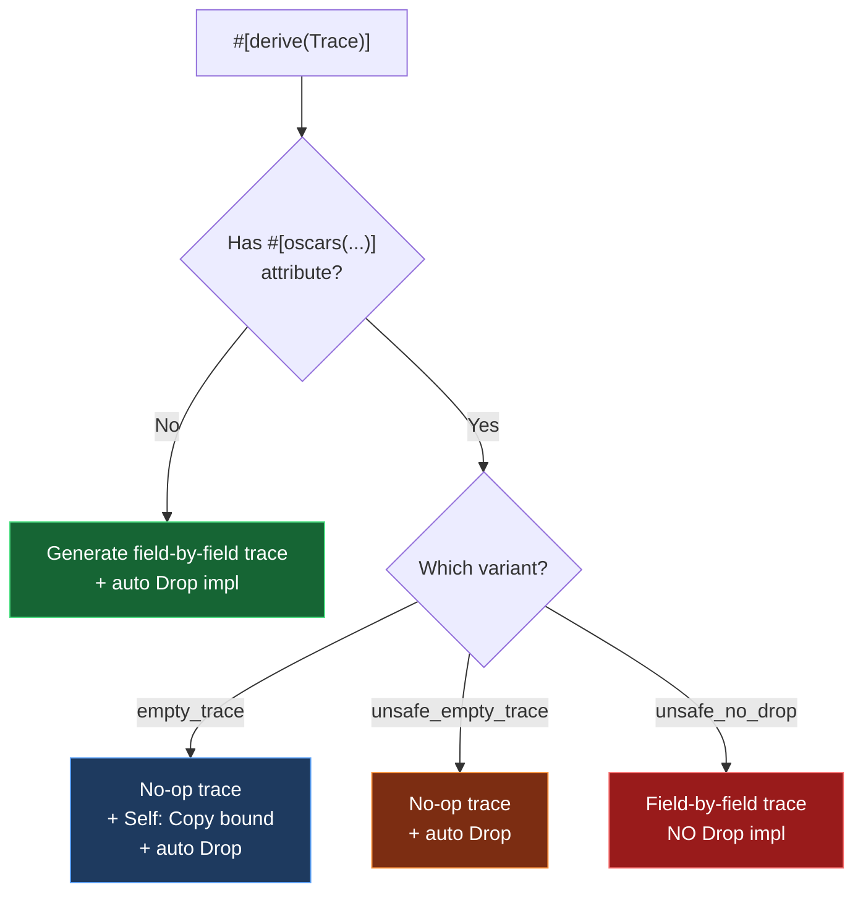

# Phase 4: The Developer Experience — `oscars_derive/` Analysis

> [!NOTE]
> This document analyzes the procedural macros that will determine how much boilerplate is required when porting Boa's 100+ AST nodes to the new GC.

---

## 1. File Map

The entire derive crate is a single file:

| File | Size | Contents |
|---|---|---|
| [oscars_derive/src/lib.rs](file:///Users/mrhapile/contributions/oscars/oscars_derive/src/lib.rs) | 148 lines | `#[derive(Trace)]` + `#[derive(Finalize)]` + 3 attribute helpers |

Dependencies: `syn` (full + visit-mut), `quote`, `proc-macro2`, `synstructure`, `cfg-if`

---

## 2. Two Derive Macros

### 2.1 `#[derive(Trace)]`

The primary macro. Declared via `synstructure::decl_derive!`:

```rust
decl_derive! {
    [Trace, attributes(oscars_gc, unsafe_ignore_trace)] =>
    derive_trace
}
```

### 2.2 `#[derive(Finalize)]`

A trivial derive that generates an empty [Finalize](file:///Users/mrhapile/contributions/oscars/oscars/src/collectors/mark_sweep/trace.rs#22-26) impl:

```rust
fn derive_finalize(s: Structure<'_>) -> proc_macro2::TokenStream {
    s.unbound_impl(quote!(::oscars::mark_sweep::Finalize), quote!())
}
```

This generates:
```rust
impl Finalize for MyStruct {}  // empty finalize() — uses default no-op
```

---

## 3. `#[derive(Trace)]` — The Full Picture

### 3.1 What It Generates

For a normal struct/enum (no special attributes), `#[derive(Trace)]` generates **two things**:

#### A. `unsafe impl Trace` with two methods

```rust
unsafe impl Trace for MyStruct {
    #[inline]
    unsafe fn trace(&self, color: ::oscars::mark_sweep::TraceColor) {
        fn mark<T: ::oscars::mark_sweep::Trace + ?Sized>(it: &T, color: TraceColor) {
            unsafe { ::oscars::mark_sweep::Trace::trace(it, color); }
        }
        match *self {
            MyStruct { ref field1, ref field2, .. } => {
                ::oscars::mark_sweep::Trace::trace(field1, color);
                ::oscars::mark_sweep::Trace::trace(field2, color);
            }
        }
    }

    #[inline]
    fn run_finalizer(&self) {
        ::oscars::mark_sweep::Finalize::finalize(self);
        fn mark<T: ::oscars::mark_sweep::Trace + ?Sized>(it: &T) {
            unsafe { ::oscars::mark_sweep::Trace::run_finalizer(it); }
        }
        match *self {
            MyStruct { ref field1, ref field2, .. } => {
                mark(field1);
                mark(field2);
            }
        }
    }
}
```

#### B. `impl Drop` that calls `Finalize::finalize`

```rust
impl Drop for MyStruct {
    #[inline(always)]
    fn drop(&mut self) {
        ::oscars::mark_sweep::Finalize::finalize(self);
    }
}
```

> [!IMPORTANT]
> The auto-generated [Drop](file:///Users/mrhapile/contributions/oscars/oscars/src/collectors/mark_sweep/tests.rs#1019-1022) impl serves a dual purpose:
> 1. It ensures `Finalize::finalize()` runs during normal Rust drops
> 2. It **prevents users from writing their own [Drop](file:///Users/mrhapile/contributions/oscars/oscars/src/collectors/mark_sweep/tests.rs#1019-1022) impl** — one of the struct has a derive, the compiler enforces that only the generated Drop exists. Users must use [Finalize](file:///Users/mrhapile/contributions/oscars/oscars/src/collectors/mark_sweep/trace.rs#22-26) instead.

### 3.2 What It Does NOT Generate

| boa_gc generates | oscars generates | Status |
|---|---|---|
| [trace(&self, tracer: &mut Tracer)](file:///Users/mrhapile/contributions/oscars/oscars/src/collectors/mark_sweep/internals/gc_box.rs#107-118) | [trace(&self, color: TraceColor)](file:///Users/mrhapile/contributions/oscars/oscars/src/collectors/mark_sweep/internals/gc_box.rs#107-118) | ✅ Different signature, same purpose |
| `trace_non_roots(&self)` | ❌ **Not generated** | Eliminated — oscars uses direct `root_count` |
| [run_finalizer(&self)](file:///Users/mrhapile/contributions/oscars/oscars/src/collectors/mark_sweep/internals/gc_box.rs#20-23) | [run_finalizer(&self)](file:///Users/mrhapile/contributions/oscars/oscars/src/collectors/mark_sweep/internals/gc_box.rs#20-23) | ✅ Same |
| [Drop](file:///Users/mrhapile/contributions/oscars/oscars/src/collectors/mark_sweep/tests.rs#1019-1022) impl | [Drop](file:///Users/mrhapile/contributions/oscars/oscars/src/collectors/mark_sweep/tests.rs#1019-1022) impl | ✅ Same pattern |

> [!TIP]
> **The elimination of `trace_non_roots` is a significant simplification.** In `boa_gc`, every derived type needs both [trace](file:///Users/mrhapile/contributions/oscars/oscars/src/collectors/mark_sweep/internals/gc_box.rs#107-118) (for marking) and `trace_non_roots` (for root-count discovery). Oscars drops the second pass entirely because root detection uses `GcHeader::root_count` directly.

---

## 4. Handling Complex Types

### 4.1 Enums

`synstructure` handles enums automatically via the `s.each(|bi| ...)` iterator, which generates a `match *self` arm for **every variant** of every variant's fields:

```rust
#[derive(Trace, Finalize)]
enum Expr {
    Literal(u64),                    // traced: u64 has empty_trace
    Binary { left: Gc<Expr>, right: Gc<Expr> },  // traces both fields
    Unary(Gc<Expr>),                 // traces the single field
}
```

Generated trace:
```rust
match *self {
    Expr::Literal(ref __binding_0) => {
        ::oscars::mark_sweep::Trace::trace(__binding_0, color);
    }
    Expr::Binary { ref left, ref right } => {
        ::oscars::mark_sweep::Trace::trace(left, color);
        ::oscars::mark_sweep::Trace::trace(right, color);
    }
    Expr::Unary(ref __binding_0) => {
        ::oscars::mark_sweep::Trace::trace(__binding_0, color);
    }
}
```

### 4.2 Ignored Fields — `#[unsafe_ignore_trace]`

Fields annotated with `#[unsafe_ignore_trace]` are **filtered out** before code generation:

```rust
s.filter(|bi| {
    !bi.ast()
        .attrs
        .iter()
        .any(|attr| attr.path().is_ident("unsafe_ignore_trace"))
});
```

Example:
```rust
#[derive(Trace, Finalize)]
struct JsObject {
    properties: Gc<PropertyMap>,
    #[unsafe_ignore_trace]
    cached_hash: u64,           // ← not traced (no GC pointers inside)
}
```

The generated code will only call [trace](file:///Users/mrhapile/contributions/oscars/oscars/src/collectors/mark_sweep/internals/gc_box.rs#107-118) on `properties`, completely skipping `cached_hash`.

> [!WARNING]
> The attribute is deliberately named `unsafe_ignore_trace` — misusing it (e.g., on a field containing `Gc<T>`) will cause the GC to miss live references, leading to use-after-free.

### 4.3 Bounds

`synstructure` is configured to add trait bounds only on **fields that are actually traced**:

```rust
s.add_bounds(AddBounds::Fields);
```

This means if a struct has `#[unsafe_ignore_trace]` fields, those fields' types do NOT need to implement [Trace](file:///Users/mrhapile/contributions/oscars/oscars/src/collectors/mark_sweep/trace.rs#49-62).

---

## 5. Three Crate-Level Attributes

The `#[oscars(...)]` attribute on the struct/enum itself supports three modes:

| Attribute | Effect on [Trace](file:///Users/mrhapile/contributions/oscars/oscars/src/collectors/mark_sweep/trace.rs#49-62) | Effect on [Drop](file:///Users/mrhapile/contributions/oscars/oscars/src/collectors/mark_sweep/tests.rs#1019-1022) | Use Case |
|---|---|---|---|
| `#[oscars(empty_trace)]` | Generates no-op [trace()](file:///Users/mrhapile/contributions/oscars/oscars/src/collectors/mark_sweep/internals/gc_box.rs#107-118) + adds `Self: Copy` bound | Generates [Drop](file:///Users/mrhapile/contributions/oscars/oscars/src/collectors/mark_sweep/tests.rs#1019-1022) | Types that contain no GC pointers AND are `Copy` |
| `#[oscars(unsafe_empty_trace)]` | Generates no-op [trace()](file:///Users/mrhapile/contributions/oscars/oscars/src/collectors/mark_sweep/internals/gc_box.rs#107-118) | Generates [Drop](file:///Users/mrhapile/contributions/oscars/oscars/src/collectors/mark_sweep/tests.rs#1019-1022) | Types with no GC pointers, not necessarily `Copy` |
| `#[oscars(unsafe_no_drop)]` | Normal field-by-field trace | ❌ **No [Drop](file:///Users/mrhapile/contributions/oscars/oscars/src/collectors/mark_sweep/tests.rs#1019-1022) generated** | Types that need custom Drop logic alongside Trace |

### Decision Logic Flow



---

## 6. Comparison with `boa_gc` Derive

| Feature | `boa_gc` derive | `oscars` derive | Migration Impact |
|---|---|---|---|
| **[trace()](file:///Users/mrhapile/contributions/oscars/oscars/src/collectors/mark_sweep/internals/gc_box.rs#107-118) generation** | ✅ Per-field traversal | ✅ Per-field traversal | 🟢 Same pattern |
| **`trace_non_roots()` generation** | ✅ Generated | ❌ **Eliminated** | 🟢 Less code to generate |
| **[run_finalizer()](file:///Users/mrhapile/contributions/oscars/oscars/src/collectors/mark_sweep/internals/gc_box.rs#20-23) generation** | ✅ Generated | ✅ Generated | 🟢 Same |
| **Auto [Drop](file:///Users/mrhapile/contributions/oscars/oscars/src/collectors/mark_sweep/tests.rs#1019-1022) impl** | ✅ Generated | ✅ Generated | 🟢 Same |
| **`#[unsafe_ignore_trace]`** | ✅ Supported | ✅ Supported | 🟢 Same attribute name |
| **`empty_trace!()` macro** | ✅ Available | ✅ Available | 🟢 Same name, same semantics |
| **`custom_trace!()` macro** | ✅ Available | ✅ Available | 🟢 Same pattern (`this, mark, body`) |
| **`unsafe_empty_trace!()`** | ✅ Available | Via `#[oscars(unsafe_empty_trace)]` | 🟡 Different surface (attribute vs macro) |
| **Tracer argument** | `&mut Tracer` | `TraceColor` | 🟡 Different type — affects manual impls |
| **Enum handling** | Via synstructure | Via synstructure | 🟢 Same mechanism |
| **Trait path** | `::boa_gc::Trace` | `::oscars::mark_sweep::Trace` | 🟡 Path rename only |

---

## 7. Real Usage Examples from Tests

### 7.1 Simple Struct with Gc Fields (auto-derive)

```rust
#[derive(Debug, Finalize, Trace)]
struct Node {
    _id: usize,
    next: Option<Gc<Node>>,
}
```
Traces [_id](file:///Users/mrhapile/contributions/oscars/oscars/src/collectors/mark_sweep/pointers/gc.rs#65-68) (no-op, `usize` has [empty_trace](file:///Users/mrhapile/contributions/oscars/oscars/src/collectors/mark_sweep/tests.rs#955-970)) and `next` (traces into `Option<Gc<Node>>`).

### 7.2 Struct with GcRefCell (cycle support)

```rust
#[derive(Debug, Finalize, Trace)]
struct CycleNode {
    _label: u64,
    next: GcRefCell<Option<Gc<CycleNode>>>,
}
```
The derived [trace](file:///Users/mrhapile/contributions/oscars/oscars/src/collectors/mark_sweep/internals/gc_box.rs#107-118) calls through `GcRefCell::trace`, which skips the value if it's currently being written to.

### 7.3 Custom Finalize with Derived Trace

```rust
#[derive(Trace)]  // Only derive Trace, NOT Finalize
struct Flagged {
    flag: Gc<GcRefCell<bool>>,
}

impl Finalize for Flagged {
    fn finalize(&self) {
        *self.flag.borrow_mut() = true;  // custom cleanup logic
    }
}
```
The `#[derive(Trace)]` still generates the [Drop](file:///Users/mrhapile/contributions/oscars/oscars/src/collectors/mark_sweep/tests.rs#1019-1022) impl that calls `Finalize::finalize`, so the custom finalize runs on drop.

### 7.4 Manual Trace with `empty_trace!()`

```rust
impl Finalize for DropSpy {}

unsafe impl Trace for DropSpy {
    crate::empty_trace!();  // no GC fields to trace
}
```
For types that can't use derive (e.g., containing `Rc` or other non-Trace types).

### 7.5 AST-like Struct with ThinVec

```rust
#[derive(Finalize, Trace)]
struct AstNode {
    value: u64,
    children: ThinVec<Gc<AstNode>>,
}
```
Traces [value](file:///Users/mrhapile/contributions/oscars/oscars/src/collectors/mark_sweep/internals/ephemeron.rs#43-49) (no-op) and `children` (iterates through ThinVec, tracing each `Gc<AstNode>`). This is exactly the pattern Boa's AST nodes will use.

---

## 8. Migration Cost for Boa's AST Nodes

### 8.1 What's Essentially Free (no code changes)

- ✅ `#[derive(Trace, Finalize)]` on structs — same pattern
- ✅ `#[unsafe_ignore_trace]` on fields — same attribute name
- ✅ `custom_trace!()` macro — same API shape
- ✅ `empty_trace!()` macro — same name and behavior
- ✅ Enum variant handling — same synstructure mechanism

### 8.2 What Requires Mechanical Changes

| Change | Scope | Effort |
|---|---|---|
| `boa_gc::Trace` → `oscars::mark_sweep::Trace` | All `use` imports | 🟢 Find-and-replace |
| `Gc::new(value)` → `Gc::new_in(value, collector)` | Every allocation site | 🟡 **Medium** — need collector threading |
| `&mut Tracer` → `TraceColor` in manual [Trace](file:///Users/mrhapile/contributions/oscars/oscars/src/collectors/mark_sweep/trace.rs#49-62) impls | ~20-30 manual impls in Boa | 🟡 Medium |
| `trace_non_roots()` removal from manual impls | All manual [Trace](file:///Users/mrhapile/contributions/oscars/oscars/src/collectors/mark_sweep/trace.rs#49-62) impls | 🟢 Delete the method |
| `unsafe_empty_trace!()` → `#[oscars(unsafe_empty_trace)]` | ~15 foreign type impls | 🟢 Small |

### 8.3 What Requires Architectural Changes

| Change | Impact |
|---|---|
| **Collector threading** — `Gc::new_in` requires a `&Collector` at every allocation site | 🔴 **Major** — Boa currently uses thread-local GC state. Every function that allocates needs access to a collector reference. |
| **No `Gc::new_cyclic`** — used for self-referential structures | 🔴 **Blocker** — must be implemented before migration |
| **No `force_collect()` / [finalizer_safe()](file:///Users/mrhapile/contributions/oscars/oscars/src/collectors/mark_sweep/tests.rs#825-857)** | 🟡 Must be added for test and runtime compatibility |

---

## 9. Summary

| Question | Answer |
|---|---|
| **Does derive auto-generate [trace](file:///Users/mrhapile/contributions/oscars/oscars/src/collectors/mark_sweep/internals/gc_box.rs#107-118)?** | ✅ Yes — per-field recursive [trace()](file:///Users/mrhapile/contributions/oscars/oscars/src/collectors/mark_sweep/internals/gc_box.rs#107-118) via synstructure match arms |
| **Does derive generate `trace_non_roots`?** | ❌ **No** — eliminated entirely. Oscars uses direct `root_count`. |
| **How are enums handled?** | Automatically via `synstructure::Structure::each()` — generates one match arm per variant |
| **How are ignored fields handled?** | `#[unsafe_ignore_trace]` attribute — field is filtered out before codegen |
| **How much boilerplate for Boa migration?** | **Derive-level: near-zero.** The macro API is nearly identical. The real cost is architectural: threading a `&Collector` reference to every allocation site. |
